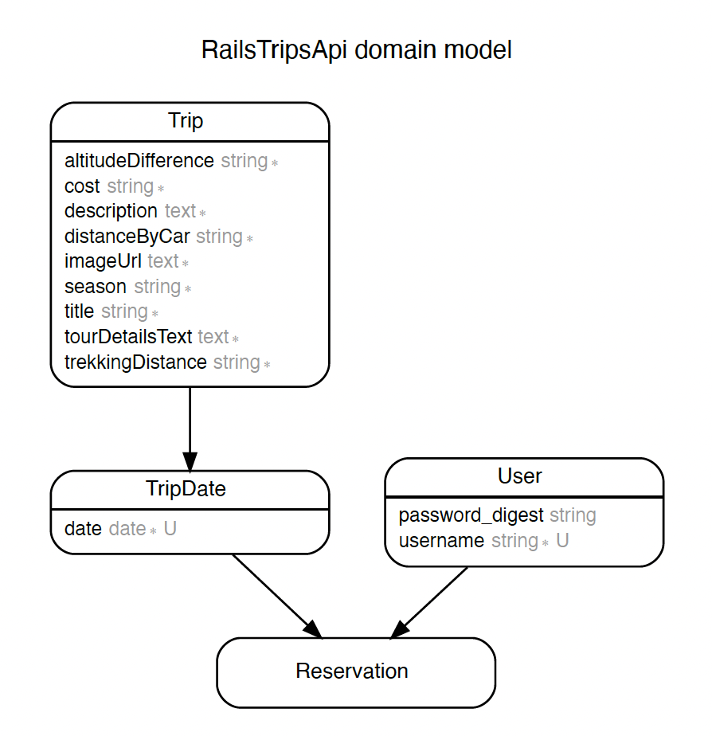

# Trips Reservation API

> A Rails API end-point application for reservation of trips.

## API Methods
### 1. GET /api/v1/trips/
  * lists trips info
  * required params: none

### 2. POST /api/v1/reservations
  * creates reservation
  * required params: (i)reservor_id, (ii)reserved_trip_date_id
  * requires Authorization provided in header (details in 5th method)

### 3. GET /api/v1/users/1
  * lists user info and his/her reservations made
  * required params: none
  * requires Authorization provided in header (details in 5th method)

### 4. POST /api/v1/users
  * creates user
  * required params: (i)username, (ii)password, (iii)password_confirmation

### 5. POST /api/v1/login
  * sends back token for (i)Authorization, (ii)username, (iii)user_id
  * required params: (i)username, (ii)password


## Built With
- Ruby v2.6.5
- Ruby on Rails v6.0.4
- PostgreSQL
- jbuilder
- AMS
- bcrypt
- Rubocop
- RSpec, database_cleaner, 
  faker, shoulda-matchers


## Live Server

[Link to live server](http://azamats-trips-api.herokuapp.com)

## ERD diagram



## Setup

```
  - **Terminal(Mac & Linux) or Command Prompt(Windows)**: This is where you will run all commands.
  - **Clone**: clone this repository to your local machine.
  - **Ruby Enviroment**: if you do not have ruby installed visit this [link](https://www.ruby-lang.org/en/documentation/installation/) to install.
  - **PostgresSQL**: if you do not have postgreSql installed visit this [link](https://www.postgresql.org/) to install.
  - **Rails**: install rails gem by running command *$ gem install rails* -v 6.0.4 in your terminal.
  - **bundle**: run $ bundle install. This installs all gems declared in the Gemfile
  - **Database Creation**: run *$ rails db:create* in the terminal to create database on your local machine
  - **Database Migration**: run *$ rails db:migrate* in terminal to run database migrations on your local machine
```

## Usage
Start server with:

```
    rails server -p 3001
```

Open `http://localhost:3001/` in your browser.


### Testing

```
    bundle exec rspec
```

### Deployment

> To deploy heroku 
  - Create a heroku account [here](https://www.heroku.com/)
  - In your root folder run the following commands
  ```
   $ heroku login: Log into heroku CLI in your browser
   $ heroku create $APP_NAME
   $ git push heroku master
   $ heroku run rails db:migrate
   $ heroku run rails c: Trip.create($PARAMS) or TripDate.create($PARAMS)
   
   example for Trip: 
    Trip.create(title: "ALAMEDIN GORGE", description: "The Alamedin Gorge is one of the four most visited and popular gorges of the Kirghiz Range.", imageUrl: "image_src", tourDetailsText: "Requires basic skills of being in the mountains.", altitudeDifference: "350 m", season: "year around", distanceByCar: "90 km", trekkingDistance: "12 km", cost: "500 KGS")
  example for TripDate: 
    TripDate.create(trip_id: 1, date: "30.11.2021")
  ```

## Author

👤 **Azamat Nuriddinov**

- Github: [@bettercallazamat](https://github.com/bettercallazamat)
- Twitter: [@azamat_nuriddin](https://twitter.com/azamat_nuriddin)
- Linkedin: [Azamat Nuriddinov](https://www.linkedin.com/in/azamat-nuriddinov/)


## 🤝 Contributing

Contributions, issues, and feature requests are welcome!

Feel free to check the [issues page](https://github.com/bettercallazamat/rails-trips-api/issues).

## Show your support

Give a ⭐️ if you like this project!

## 📝 License

This project is [MIT](https://opensource.org/licenses/MIT) licensed.